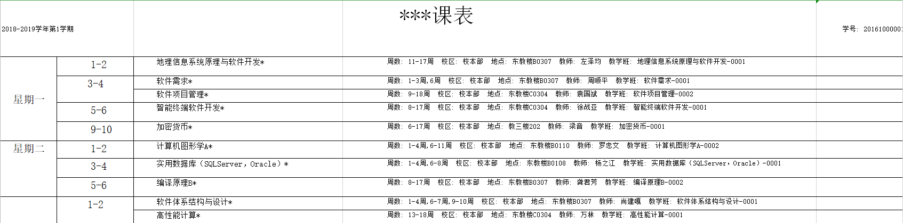

# CUGTimetable

using to solve the problem of timetable.

## our university's timetable like this

## Example Table Content

|name|type|time|during|teacher|place|
|----|----|----|-----|----|----|
|哲学|必修|周一 5-6节|1-5&6-10双&11-15单|波澜哥|教102|